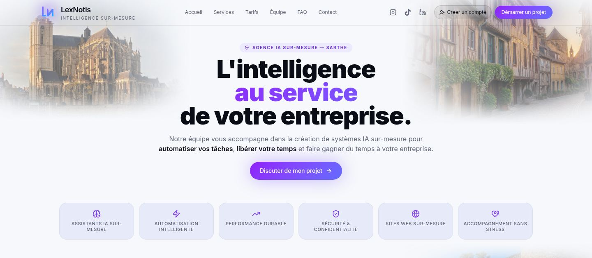
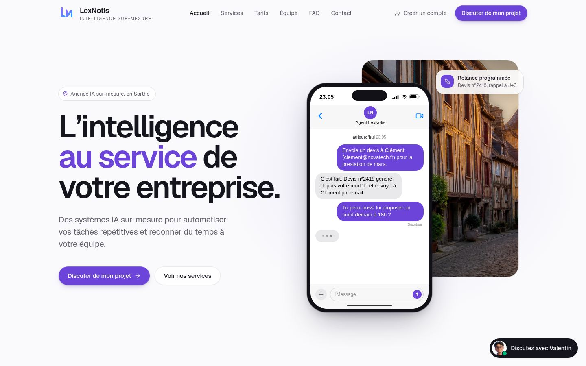

# LexNotis : refonte du design + outillage Claude

Ce dépôt contient le code de design du site LexNotis (exporté de Lovable), entièrement redessiné,
et tout ce qu'il faut pour que Claude Code conçoive, construise, teste et capture de nouvelles pages
avec un vrai niveau d'exigence.

| Avant | Après |
| --- | --- |
|  |  |

Autres captures : [page d'accueil complète](docs/screenshots/apres-accueil-page-complete.jpg),
[mobile](docs/screenshots/apres-accueil-mobile.jpg), [tarifs](docs/screenshots/apres-tarifs.jpg),
[équipe](docs/screenshots/apres-equipe.jpg), [contact](docs/screenshots/apres-contact.jpg).

## 1. Ce qui a été installé pour Claude

| Élément | Où | À quoi ça sert |
| --- | --- | --- |
| Skills d'Emil Kowalski | `.claude/skills/emil-design-eng`, `animate`, `review-animations`… | Règles concrètes d'animation et de finition (courbes, durées, retour au clic, accessibilité). |
| Taste Skill | `.claude/skills/design-taste-frontend`, `redesign-existing-projects`… | Le "goût" : bannit le look IA générique, checklist avant livraison. |
| Design system LexNotis | `.claude/skills/lexnotis-design-system` | Nos couleurs, typo, espacements, composants, et les sites de référence (Linear, Vercel, Stripe, Pennylane, Qonto, Alan…) dont on s'inspire. |
| Workflow `/concevoir` | `.claude/skills/concevoir` | Vous décrivez la page en français, Claude planifie, construit, teste et capture. |
| MCP Figma + Playwright | `.mcp.json` | Figma : lire vos maquettes et envoyer des pages vers Figma. Playwright : ouvrir le site, cliquer, capturer. |
| Banc d'essai local | `tools/preview/` | Fait tourner le site en local (backend simulé) pour les captures et les tests. |

### Activer les MCP (une seule fois)

1. Ouvrez Claude Code dans ce dossier. Les serveurs de `.mcp.json` sont pré-approuvés dans
   `.claude/settings.json` (Claude Code peut quand même demander une confirmation la première fois).
2. Tapez `/mcp`, choisissez **figma** puis **Authenticate** et connectez votre compte Figma.
   Alternative : `claude plugin install figma@claude-plugins-official`.
3. Playwright s'installe via `npx` au premier usage. S'il manque un navigateur, lancez
   `npx playwright install chromium`.

### Ensuite, il suffit de décrire

```
/concevoir Une page "Agents vocaux" pour les artisans : montrer comment l'agent répond au
téléphone quand ils sont sur un chantier, avec les tarifs et une FAQ courte.
```

Vous pouvez aussi coller un lien Figma : Claude lira la maquette et la traduira dans le design system.

## 2. Ce qui a changé sur le site

- **Identité** : un seul violet LexNotis, plus sobre ; fini les dégradés violet-bleu, le texte en
  dégradé et les halos lumineux. Police Geist auto-hébergée (aucune dépendance à ajouter).
- **Accueil** recomposé : héro en deux colonnes avec la démo iMessage de l'agent qui se joue sur une
  photo du Vieux Mans, grille "bento" des offres, bénéfices en liste fixe, chiffres clés, aperçu de
  l'espace client, section "agence de proximité en Sarthe" avec les photos du Mans, intégrations,
  et un bloc de fin sombre (appel à l'action + pied de page).
- **Toutes les pages** harmonisées : services, tarifs (prix lisibles, offre complète mise en avant),
  équipe, Gabin, FAQ (accordéon accessible), contact (formulaire plus clair, mêmes champs),
  automatisation, pages légales (sommaire latéral), 404.
- **Animations** selon les règles d'Emil Kowalski : entrées fluides, retour au clic, courbes
  personnalisées, respect de "réduire les animations", plus d'écouteur de scroll.
- **Chat Valentin** et **bandeau cookies** redessinés ; menu mobile plein écran.
- **Correctif** : dans la démo iMessage, l'indicateur "en train d'écrire" ne disparaissait jamais.
- Inchangés volontairement : URLs, menu, champs de formulaire, textes légaux, SEO (titres,
  descriptions, JSON-LD), logo, tableau de bord client.

## 3. Récupérer ces changements dans Lovable

Ce dépôt ne contient que les fichiers de design exportés. Pour mettre en ligne :

1. Dans Lovable, connectez le projet à GitHub (Lovable crée ou utilise son propre dépôt).
2. Copiez dans ce dépôt Lovable les dossiers `src/` et `public/` d'ici (ils remplacent les fichiers
   du même nom ; rien à supprimer côté Lovable hormis `src/components/GridPillars.tsx`,
   `FeatureCard.tsx` et `FounderAvatar.tsx`, devenus inutiles).
3. Aucune nouvelle dépendance npm n'est nécessaire. Les imports `@fontsource-variable/*` ne sont
   plus utilisés et peuvent être retirés de `package.json` plus tard.

Le plus simple : ouvrir Claude Code dans le dépôt Lovable, avec ce dépôt à côté, et lui demander
"reporte la refonte de lexnotisnew dans ce projet".

## 4. Prévisualiser en local

```bash
tools/preview/serve.sh                                   # http://127.0.0.1:4173
node tools/preview/screenshots.mjs screenshots/current   # captures de toutes les pages
```

Le banc d'essai simule Supabase et les fonctions serveur : la connexion, le chat et le formulaire
répondent avec des données factices.
